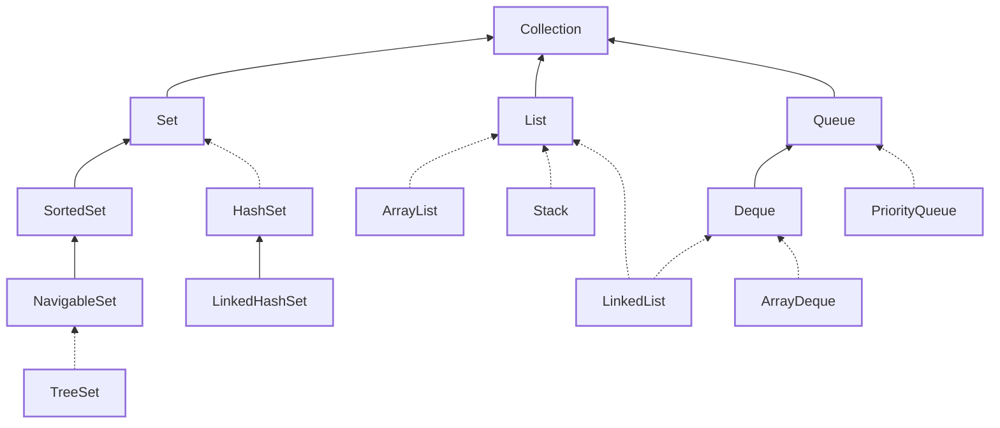
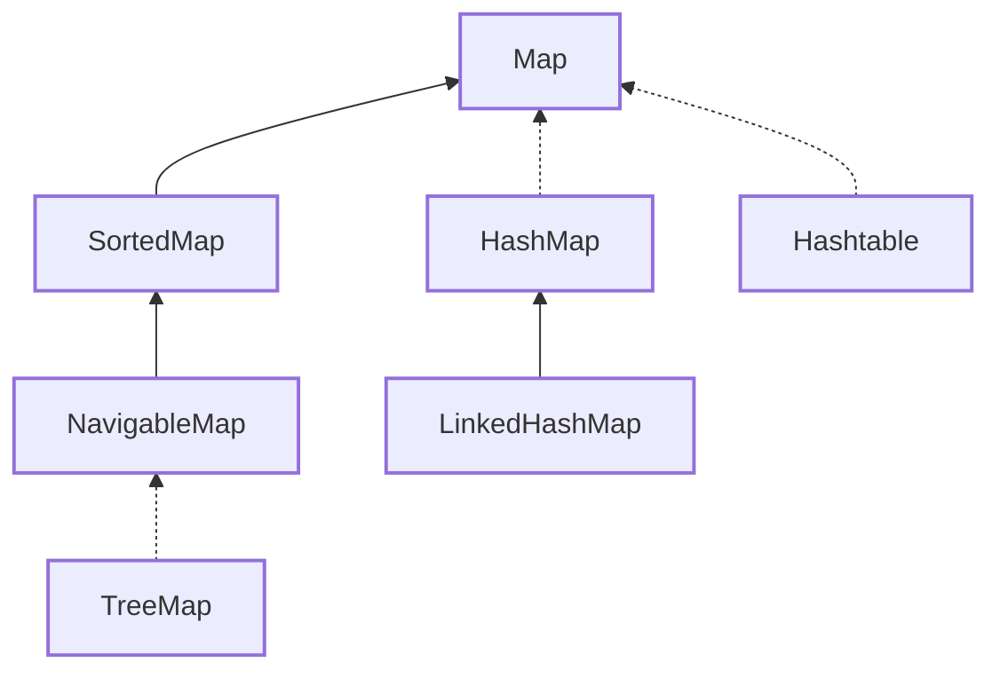
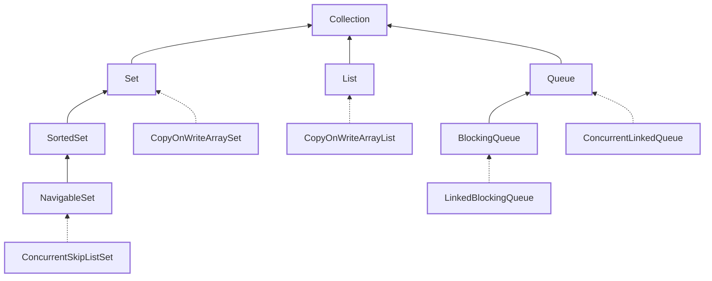
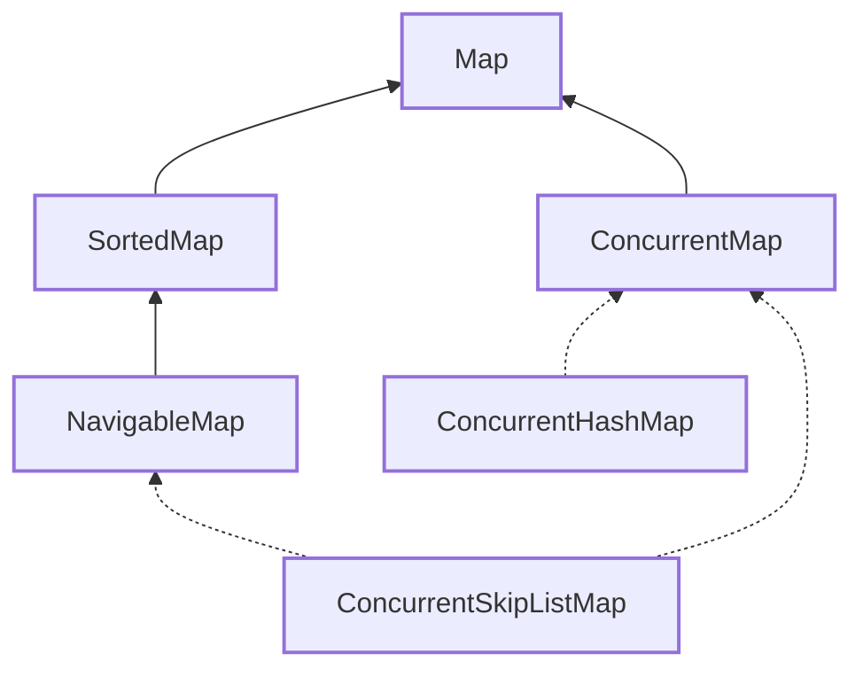

# Java Notes

- [Generics](#generics)
  - [Type Erasure](#type-erasure)
  - [Polymorphism](#polymorphism)
  - [Wildcards](#wildcards)
  - [Generic Methods](#generic-methods)
- [Lambda Expressions](#lambda-expressions)
  - [Interfaces](#interfaces)
  - [Functional Interfaces](#functional-interfaces)
  - [Lambdas](#lambdas)
  - [Method References](#method-references)
- [Streams](#streams)
  - [Optionals](#optionals)
    - [Creating Optionals](#creating-optionals)
    - [Optional Methods](#optional-methods)
  - [Stream Pipelines](#stream-pipelines)
  - [Creating Streams](#creating-streams)
    - [Infinite Streams](#infinite-streams)
  - [Terminal Operations](#terminal-operations)
    - [`reduce` Methods](#reduce-methods)
    - [Collectors](#collectors)
    - [`collect` Methods](#collect-methods)
    - [`Collectors.toMap` Methods](#collectorstomap-methods)
    - [`Collectors.groupingBy` Methods](#collectorsgroupingby-methods)
    - [`Collectors.partitioningBy` Methods](#collectorspartitioningby-methods)
  - [Intermediate Operations](#intermediate-operations)
  - [Primitive Streams](#primitive-streams)
    - [Creating Primitive Streams](#creating-primitive-streams)
    - [Primitive Stream Methods](#primitive-stream-methods)
    - [Primitive Functional Interfaces](#primitive-functional-interfaces)
    - [Primitive Mapping Streams](#primitive-mapping-streams)
  - [Parallel Streams](#parallel-streams)
- [Collections](#collections)
  - [Lists](#lists)
    - [Stacks](#stacks)
    - [Linked Lists](#linked-lists)
  - [Sets](#sets)
  - [Maps](#maps)
  - [Queues](#queues)
  - [`Comparable` and `Comparator` Interfaces](#comparable-and-comparator-interfaces)
    - [`Comparable` Interface](#comparable-interface)
    - [`Comparator` Interface](#comparator-interface)
  - [`equals` and `hashCode` Methods](#equals-and-hashcode-methods)
    - [`equals` Method](#equals-method)
    - [`hashCode` Method](#hashcode-method)
- [Concurrency](#concurrency)
  - [Creating Threads](#creating-threads)
  - [`sleep` and `join` Methods](#sleep-and-join-methods)
  - [`ExecutorService` Interface](#executorservice-interface)
    - [`Callable` Interface](#callable-interface)
    - [`Future` Interface](#future-interface)
    - [`invokeAny` and `invokeAll` Methods](#invokeany-and-invokeall-methods)
  - [Scheduling Tasks](#scheduling-tasks)
  - [Thread Safety](#thread-safety)
    - [Data Races](#data-races)
    - [Atomic Classes](#atomic-classes)
    - [`synchronized` Keyword](#synchronized-keyword)
    - [`Lock` Interface](#lock-interface)
  - [Concurrent Collections](#concurrent-collections)
    - [Skip-List Collections](#skip-list-collections)
    - [Copy-on-Write Collections](#copy-on-write-collections)
    - [Blocking Queues](#blocking-queues)
    - [Synchronized Collections](#synchronized-collections)
  - [Threading Problems](#threading-problems)
- [Localisation](#localisation)
  - [Localising Numbers and Currencies](#localising-numbers-and-currencies)
  - [Localising Dates and Times](#localising-dates-and-times)
  - [`Locale.Category` Static Enum](#localecategory-static-enum)
  - [Resource Bundles](#resource-bundles)
    - [Property Files](#property-files)
    - [Resource Bundle Search Order](#resource-bundle-search-order)
- [JDBC](#jdbc)
  - [Prepared Statements](#prepared-statements)
  - [Callable Statements](#callable-statements)
  - [Resource Leaks](#resource-leaks)
- [I/O](#io)
  - [`Console` Class](#console-class)
  - [NIO.2](#nio2)
    - [Resolving Paths](#resolving-paths)
    - [Relativizing Paths](#relativizing-paths)
    - [Normalizing Paths](#normalizing-paths)
    - [File Attributes](#file-attributes)
    - [Creating a Stream from a File](#creating-a-stream-from-a-file)
    - [Finding Files](#finding-files)
  - [Serialisation](#serialisation)
    - [Custom Serialisation](#custom-serialisation)
- [Local Variable Type Inference](#local-variable-type-inference)
- [Private Interface Methods](#private-interface-methods)
- [Modules](#modules)
  - [Compiler and Runtime Flags](#compiler-and-runtime-flags)
    - [`javac` Flags](#javac-flags)
    - [`java` Flags](#java-flags)
    - [Flags Summary](#flags-summary)
  - [Dependencies](#dependencies)
  - [Opening Packages](#opening-packages)
  - [`requires transitive`](#requires-transitive)
  - [Operations on Modules](#operations-on-modules)
  - [Services](#services)
  - [Types of Modules](#types-of-modules)
  - [Migration Strategies](#migration-strategies)
    - [Bottom-Up Strategy](#bottom-up-strategy)
    - [Top-Down Strategy](#top-down-strategy)
- [Sealed Classes](#sealed-classes)
- [Records](#records)
- [`switch` Expressions](#switch-expressions)
- [Pattern Matching](#pattern-matching)
- [Text Blocks](#text-blocks)
- [String Pool](#string-pool)
- [Immutability](#immutability)
  - [Call-by-Value](#call-by-value)
  - [Defensive Copying](#defensive-copying)
- [Nested Classes](#nested-classes)
  - [Inner Classes](#inner-classes)
  - [Static Nested Classes](#static-nested-classes)
  - [Local Classes](#local-classes)
  - [Anonymous Classes](#anonymous-classes)

## Generics

- formal type parameter in angle brackets

### Type Erasure

- generics are a strictly compile-time safety feature
- type information removed from bytecode

### Polymorphism

- polymorphism applies to *base* type
  - `List<Integer> l = new ArrayList<Integer>();` works
- polymorphism does *not* apply to generic type
  - `List<Number> l = new ArrayList<Integer>();` doesn’t work

### Wildcards

| Type        | Syntax        | Example                                                | Add Items? |
|-------------|---------------|--------------------------------------------------------|------------|
| unbound     | `?`           | `List<?> l = new ArrayList<Integer>();`                | no         |
| upper bound | `? extends T` | `List<? extends Number> l = new ArrayList<Integer>();` | no         |
| lower bound | `? super T`   | `List<? super Number> l = new Arraylist<Object>();`    | yes        |

### Generic Methods

- formal type parameter declared *immediately before* return type
  - return type may also include generics

```java
class NonGenericClass {
    static <T> void genericMethod1(T t) { }
    static <T> T genericMethod2(T t) { return t; }
    static <T> GenericClass<T> genericMethod3(T t) { return new GenericClass<>(); }
}
```

- optionally specify type when invoking generic methods
  - `NonGenericClass.<String>genericMethod1("string");`

## Lambda Expressions

### Interfaces

- interfaces may have *static* and *default* methods
  - classes *not* required to implement static or default methods
  - default methods inheritable
  - static methods *not* inheritable
- top-level interfaces may have *public* or *package-private* access

### Functional Interfaces

- SAM — Single Abstract Method
  - *default* and *static* methods don’t count
  - methods from `Object` don’t count

### Lambdas

- an instance of a functional interface

```java
@FunctionalInterface
interface I { void m(); }

public class C {
    public static void main(String[] args) {
        // method 1
        I nonLambda = new I() {
            @Override
            public void m() { System.out.println("non-lambda"); }
        };
        nonLambda.m();
        
        // method 2
        I lambda1 = () -> { System.out.println("lambda 1"); };
        lambda1.m();
        
        // method 3
        I lambda2 = () -> System.out.println("lambda 2");
        lambda2.m();
    }
}
```

| Functional Interface  | Method                   | Note                                            |
|-----------------------|--------------------------|-------------------------------------------------|
| `Predicate<T>`        | `boolean test(T t)`      |                                                 |
| `BiPredicate<T, U>`   | `boolean test(T t, U u)` |                                                 |
| `Supplier<T>`         | `T get()`                |                                                 |
| `Consumer<T>`         | `void accept(T t)`       |                                                 |
| `BiConsumer<T, U>`    | `void accept(T t, U u)`  |                                                 |
| `Function<T, R>`      | `R apply(T t)`           |                                                 |
| `BiFunction<T, U, R>` | `R apply(T t, U u)`      |                                                 |
| `UnaryOperator<T>`    | `T apply(T t)`           | `UnaryOperator<T> extends Function<T, T>`       |
| `BinaryOperator<T>`   | `T apply(T t1, T t2)`    | `BinaryOperator<T> extends BiFunction<T, T, T>` |

- local variables referenced from lambda *must* be *final* or *effectively final*
  - changing local variable used in lambda (whether inside or outside lambda) is compile error

### Method References

- 4 types
  - bound (instance known at compile-time)
  - unbound (instance provided at runtime)
  - static (considered *unbound*)
  - constructor

```java
// bound
Supplier<String> l1 = () -> s.toLowerCase();
Supplier<String> m1 = s::toLowerCase;
Predicate<String> l2 = (t) -> s.startsWith(t);
Predicate<String> m2 = s::startsWith;

// unbound
Function<String, String> l3 = s -> s.toLowerCase();
Function<String, String> m3 = String::toLowerCase;
BiPredicate<String, String> l4 = (s, t) -> s.startsWith(t);
BiPredicate<String, String> m4 = String::startsWith;

// static
Consumer<List<Integer>> l5 = l -> Collections.sort(l);
Consumer<List<Integer>> m5 = Collections::sort;

// constructor
Supplier<StringBuilder> l6 = () -> new StringBuilder();
Supplier<StringBuilder> m6 = StringBuilder::new;
Function<Integer, List<String>> l7 = n -> new ArrayList<>(n);
Function<Integer, List<String>> m7 = ArrayList::new;
```

## Streams

- `interface Stream<T>`
- sequence of data to be processed with operations
  - *not* data structure

### Optionals

- `class Optional<T>`
- for primitive types — `OptionalInt`, `OptionalLong`, and `OptionalDouble`

#### Creating Optionals

- `static <T> Optional<T> empty()`
- `static <T> Optional<T> of(T value)`
  - throws `NullPointerException` if `value` is null
- `static <T> Optional<T> ofNullable(T value)`

#### Optional Methods

- `boolean isEmpty()`
- `boolean isPresent()`
- `T get()`
  - throws `NoSuchElementException` if empty
  - for primitive types — `int getAsInt()`, `long getAsLong()`, and `double getAsDouble()`
- `void ifPresent(Consumer<? super T> action)`
  - does nothing if empty
- `void ifPresentOrElse(Consumer<? super T> action, Runnable emptyAction)`
  - performs `emptyAction` if empty
- `T orElse(T other)`
  - returns `other` if empty
- `T orElseGet(Supplier<? extends T> supplier)`
  - returns `supplier` result if empty

### Stream Pipelines

- consists of operations that run on stream to produce result
- 3 parts — source, intermediate operations, and terminal operation
  - terminal operation required to start the process (lazy evaluation)
  - each stream only used once, no longer usable after terminal operation

### Creating Streams

- static generic method `Arrays.stream()`
- default method `Collection.stream()`
- static generic method `Stream.of()`
- static method `Files.lines()`

#### Infinite Streams

- static generic method `Stream.generate()`
- static generic method `Stream.iterate()`
- may be turned into finite streams with intermediate operations such as `limit()`

### Terminal Operations

- *reductions* are special type of terminal operation where *all* contents of stream are combined into single primitive
or object

| Method                                                               | Return Type   | Reduction?                       |
|----------------------------------------------------------------------|---------------|----------------------------------|
| `count()`                                                            | `long`        | yes                              |
| `min(Comparator)`, `max(Comparator)`                                 | `Optional<T>` | yes                              |
| `findAny()`, `findFirst()`                                           | `Optional<T>` | no, may not process all contents |
| `allMatch(Predicate)`, `anyMatch(Predicate)`, `noneMatch(Predicate)` | `boolean`     | no, may not process all contents |
| `forEach(Consumer)`                                                  | `void`        | no, doesn’t return anything      |
| `reduce`, `collect`                                                  | varies        | yes                              |

#### `reduce` Methods

- `T reduce(T identity, BinaryOperator<T> accumulator)`

```java
String s = Stream.of("a", "b", "c").reduce("", (s1, s2) -> s1 + s2);    // "abc"
Integer i = Stream.of(1, 2, 3).reduce(1, (i1, i2) -> i1 * i2);          // 6
```

- `Optional<T> reduce(BinaryOperator<T> accumulator)`
  - empty stream → empty optional returned
  - one element in stream → sole element returned
  - multiple elements in stream → accumulator applied and result returned

```java
BinaryOperator<Integer> op = (i1, i2) -> i1 + i2;
Stream<Integer> empty = Stream.empty();
Stream<Integer> oneEl = Stream.of(0);
Stream<integer> mulEl = Stream.of(1, 2, 3);
empty.reduce(op).ifPresent(System.out::print);  // nothing printed
oneEl.reduce(op).ifPresent(System.out::print);  // 0 printed
mulEl.reduce(op).ifPresent(System.out::print);  // 6 printed
```

- `<U> U reduce(U identity, BiFunction<U, ? super T, U> accumulator, BinaryOperator<U> combiner)`
  - creates intermediate reductions with accumulator and then combine reductions in the end with combiner
  - useful for parallel streams when streams can be decomposed and reassembled by separate threads

```java
int len = Stream.of("a", "bc", "def", "ghij")   // 10
        .reduce(0,
                (i, s) -> i + s.length(),
                (i1, i2) -> i1 + i2);
```

#### Collectors

- `interface Collector<T, A, R>`
- `class Collectors` provides pre-defined collectors via static methods

#### `collect` Methods

- special type of reduction — *mutable reduction*
  - more efficient than regular reduction
- `<R> R collect(Supplier<R> supplier, BiConsumer<R, ? super T> accumulator, BiConsumer<R, R> combiner)`
  - accumulator adds element to collection, then combiner merges two collections
  - useful for parallel processing

```java
StringBuilder word = Stream.of("ad", "jud", "i", "cate")    // "adjudicate"
        .collect(() -> new StringBuilder(),         // StringBuilder::new
                 (sb, s) -> sb.append(s),           // StringBuilder::append
                 (sb1, sb2) -> sb1.append(sb2));    // StringBuilder::append
```

- `<R, A> R collect(Collector<? super T, A, R> collector)`

```java
String str = Stream.of("a", "bc", "def")    // "a, bc, def"
        .collect(Collectors.joining(", "));
Double avg = Stream.of("a", "bc", "def")    // 2.0
        .collect(Collectors.averagingInt(s -> s.length())); // String::length
```

#### `Collectors.toMap` Methods

- two functions required
  - 1st function, key mapper, tells collector how to create keys
  - 2nd function, value mapper, tells collector how to create values

```java
Map<String, Integer> m = Stream.of("a", "b", "c")   // {a=1, b=1, c=1}
        .collect(Collectors.toMap(s -> s,
                                  s -> s.length()));    // String::length
```

- 3rd function, merge function, also required if mapped keys repeat

```java
Map<Integer, String> m = Stream.of("a", "b", "cd")  // {1=a,b, 2=cd}
        .collect(Collectors.toMap(s -> s.length(),  // String::length
                                  s -> s,
                                  (s1, s2) -> s1 + "," + s2));
```

- 4th function, map factory, also required if specific map implementation desired

```java
TreeMap<String, Integer> m = Stream.of("a", "b", "a")   // {a=2, b=1}
        .collect(Collectors.toMap(s -> s,
                                  s -> s.length(),              // String::length
                                  (len1, len2) -> len1 + len2,  // Integer::sum
                                  () -> new TreeMap<>()));      // TreeMap::new
```

#### `Collectors.groupingBy` Methods

- requires one function, classifier, and collects into map
  - classifier determines map keys
  - map values are lists of all entries that match key

```java
Map<Integer, List<String>> m = Stream.of("a", "b", "cd")    // {1=[a, b], 2=[cd]}
        .collect(Collectors.groupingBy(s -> s.length()));   // String::length
```

- optionally takes downstream collector, processing map *values*

```java
Map<Integer, Set<String>> m = Stream.of("a", "b", "cd", "a")    // {1=[a, b], 2=[cd]}
        .collect(Collectors.groupingBy(s -> s.length(), // String::length
                                       Collectors.toSet()));
```

- optionally takes map factory supplier, guaranteeing returned map type

```java
TreeMap<Integer, List<String>> m = Stream.of("a", "b", "cd")    // {1=[a, b], 2=[cd]}
        .collect(Collectors.groupingBy(s -> s.length(),         // String::length
                                       () -> new TreeMap<>(),   // TreeMap::new
                                       Collectors.toList()));
```

#### `Collectors.partitioningBy` Methods

- special case of grouping with two groups
  - requires predicate
  - map keys are *true* and *false*

```java
Map<Boolean, List<String>> m = Stream.of("a", "b", "ac")    // {false=[b], true=[a, ac]}
        .collect(Collectors.partitioningBy(s -> s.startsWith("a")));
```

- optionally takes downstream collector

```java
Map<Boolean, Set<String>> m = Stream.of("a", "bc", "a") // {false=[a], true=[bc]}
        .collect(Collectors.partitioningBy(s -> s.length() > 1,
                                           Collectors.toSet()));
```

### Intermediate Operations

- `filter` method
  - `Stream<T> filter(Predicate<? super T> predicate)`
- `distinct` method
  - `Stream<T> distinct()`
  - stateful
- `limit` method
  - `Stream<T> limit(long maxSize)`
  - stateful and short-circuiting
- `map` method
  - `<R> Stream<R> map(Function<? super T, ? extends R> mapper)`

```java
Stream.of("a", "bc", "def")
        .map(s -> s.length())   // String::length
        .forEach(System.out::print);    // 123 printed
```

- `flatMap` method
  - `<R> Stream<R> flatMap(Function<? super T, ? extends Stream<? extends R>> mapper)`

```java
List<String> l1 = Arrays.asList("a", "b");
List<String> l2 = Arrays.asList("c", "d");
Stream.of(l1, l2)
        .flatMap(l -> l.stream())   // Collection::stream
        .forEach(System.out::print);    // abcd printed
```

- `sorted` methods
  - `Stream<T> sorted()`
  - `Stream<T> sorted(Comparator<? super T> comparator)`
  - stateful and needs to process all contents up to this operation before sorting

```java
Stream.of("abc", "d", "ef")
        .sorted(Comparator.comparing(s -> s.length()))  // String::length
        .forEach(System.out::print);    // defabc printed
```

### Primitive Streams

- `IntStream` for primitives *int*, *short*, *byte*, and *char*
- `LongStream` for primitive *long*
- `DoubleStream` for primitives *double* and *float*

#### Creating Primitive Streams

- static method `Arrays.stream`
- static methods `IntStream.of`, `LongStream.of`, and `DoubleStream.of`

#### Primitive Stream Methods

- `min`, `max`, `sum`, and `average` methods

```java
Stream.of(1, 2, 3)
        .reduce((i1, i2) -> i1 + i2)    // Integer::sum
        .ifPresent(System.out::println);            // 6 printed
System.out.println(IntStream.of(1, 2, 3).sum());    // 6 printed
```

| Class          | Method           | Return Type      |
|----------------|------------------|------------------|
| `IntStream`    | `average()`      | `OptionalDouble` |
| `LongStream`   | `average()`      | `OptionalDouble` |
| `DoubleStream` | `average()`      | `OptionalDouble` |
| `IntStream`    | `min()`, `max()` | `OptionalInt`    |
| `LongStream`   | `min()`, `max()` | `OptionalLong`   |
| `DoubleStream` | `min()`, `max()` | `OptionalDouble` |
| `IntStream`    | `sum()`          | `int`            |
| `LongStream`   | `sum()`          | `long`           |
| `DoubleStream` | `sum()`          | `double`         |

- `summaryStatistics` methods

```java
IntSummaryStatistics is1 = IntStream.of(1, 2, 3).summaryStatistics();
System.out.println(is1.getMin());       // 1 printed
System.out.println(is1.getMax());       // 3 printed
System.out.println(is1.getAverage());   // 2.0 printed
System.out.println(is1.getCount());     // 3 printed
System.out.println(is1.getSum());       // 6 printed

IntSummaryStatistics is2 = IntStream.empty().summaryStatistics();
System.out.println(is2.getMin());       // 2147483647 printed
System.out.println(is2.getMax());       // -2147483648 printed
System.out.println(is2.getAverage());   // 0.0 printed
System.out.println(is2.getCount());     // 0 printed
System.out.println(is2.getSum());       // 0 printed
```

#### Primitive Functional Interfaces

| Functional Interface   | Method                                 |
|------------------------|----------------------------------------|
| `IntSupplier`          | `int getAsInt()`                       |
| `LongSupplier`         | `long getAsLong()`                     |
| `DoubleSupplier`       | `double getAsDouble()`                 |
| `IntConsumer`          | `void accept(int)`                     |
| `LongConsumer`         | `void accept(long)`                    |
| `DoubleConsumer`       | `void accept(double)`                  |
| `IntPredicate`         | `boolean test(int)`                    |
| `LongPredicate`        | `boolean test(long)`                   |
| `DoublePredicate`      | `boolean test(double)`                 |
| `IntFunction<R>`       | `R apply(int)`                         |
| `LongFunction<R>`      | `R apply(long)`                        |
| `DoubleFunction<R>`    | `R apply(double)`                      |
| `IntUnaryOperator`     | `int applyAsInt(int)`                  |
| `LongUnaryOperator`    | `long applyAsLong(long)`               |
| `DoubleUnaryOperator`  | `double applyAsDouble(double)`         |
| `IntBinaryOperator`    | `int applyAsInt(int, int)`             |
| `LongBinaryOperator`   | `long applyAsLong(long, long)`         |
| `DoubleBinaryOperator` | `double applyAsDouble(double, double)` |

#### Primitive Mapping Streams

|                     | To `Stream<T>`             | To `IntStream`                  | To `LongStream`                   | To `DoubleStream`                   |
|---------------------|----------------------------|---------------------------------|-----------------------------------|-------------------------------------|
| From `Stream<T>`    | `map(Function)`            | `mapToInt(ToIntFunction)`       | `mapToLong(ToLongFunction)`       | `mapToDouble(ToDoubleFunction)`     |
| From `IntStream`    | `mapToObj(IntFunction)`    | `map(IntUnaryOperator)`         | `mapToLong(IntToLongFunction)`    | `mapToDouble(IntToDoubleFunction)`  |
| From `LongStream`   | `mapToObj(LongFunction)`   | `mapToInt(LongToIntFunction)`   | `map(LongUnaryOperator)`          | `mapToDouble(LongToDoubleFunction)` |
| From `DoubleStream` | `mapToObj(DoubleFUnction)` | `mapToInt(DoubleToIntFunction)` | `mapToLong(DoubleToLongFunction)` | `map(DoubleUnaryOperator)`          |

### Parallel Streams

- stream pipelines execute either sequentially or in parallel
- property of stream
- default method `Collection.stream()` creates sequential stream
- default method `Collection.parallelStream()` creates parallel stream
- modifiable by instance method `BaseStream.sequential()` and `BaseStream.parallel()`
- may be queried by instance method `BaseStream.isParallel`

```java
Stream.of("a", "b", "c").forEach(System.out::print);            // abc printed
Stream.of("a", "b", "c").parallel().forEach(System.out::print); // bca printed
```

## Collections

- `interface Collection<E>`





| Method | Return Type | Note |
| --- | --- | --- |
| `add(E)` | `boolean` |  |
| `remove(Object)` | `boolean` |  |
| `isEmpty()` | `boolean` |  |
| `size()` | `int` |  |
| `clear()` | `void` |  |
| `contains(Object)` | `boolean` |  |
| `removeIf(Predicate)` | `boolean` | default |
| `forEach(Consumer)` | `void` | default inherited from `Iterable`  |

### Lists

- `Arrays.asList` links the array and list together, where changes to array goes to the list and vice versa
    - cannot add or delete but can replace
- `List.of` and `List.copyOf` both return immutable lists

#### Stacks

- `push`, `peek`, and `pop`

#### Linked Lists

- `addFirst`, `addLast`, `removeFirst`, and `removeLast`

### Sets

`interface Map<K, V>`

- `HashSet` has no order, efficiency depends on `hashCode` implementation
- `LinkedHashSet` is ordered by insertion, elements doubly linked
- `TreeSet` can be ordered naturally or custom ordered by comparator at creation time
- `Set.of` and `Set.copyOf` both return immutable sets

### Maps

- `HashMap` is unsorted and unordered, efficiency depends on `hashCode` implementation
    - allows one null key and multiple null values
- `LinkedHashMap` maintains insertion order
- `TreeMap` is sorted naturally by keys or custom sorted by comparator
- `Hashtable` is thread-safe and slower version of `HashMap` and nulls are not allowed
    
    
    | Method | Return Type | Note |
    | --- | --- | --- |
    | `clear()` | `void` | removes all keys and values |
    | `containsKey(Object)` | `boolean` |  |
    | `containsValue(Object)` | `boolean` |  |
    | `entrySet()` | `Set<Map.Entry<K, V>>` | return a `Set` view of the pairs |
    | `forEach(BiConsumer)` | `void` |  |
    | `get(Object)` | `V` |  |
    | `isEmpty()` | `boolean` |  |
    | `keySet()` | `Set<K>` | return a `Set` view of the keys |
    | `put(K, V)` | `V` | add or replace; return previous or null |
    | `putIfAbsent(K, V)` | `V` | add and return null if absent; else existing |
    | `remove(Object)` | `V` | return previous or null |
    | `replace(K, V)` | `V` | return previous or null |
    | `replaceAll(BiFunction)` | `void` | replace value |
    | `size()` | `int` |  |
    | `values()` | `Collection<V>` | return a `Collection` view of the values |

### Queues

- first-in first-out
    - except priority queues, where order is natural or by comparator
- `PriorityQueue` is priority-in priority-out, sort by natural order or by comparator
    - first sorted elements accessed first
- `Deque` is double ended
    - `ArrayDeque` is expandable-array implementation, faster than `Stack` when used as a stack and faster than `LinkedList` when used as a queue

|  | Throws Exception | Returns Special Value |
| --- | --- | --- |
| Examine | `element` | `peek` |
| Insert | `add` | `offer` |
| Remove | `remove` | `poll` |

`Deque` have methods with `First` and `Last` suffixes to the above methods, except `element` is replaced by `get`

- when using `Deque` as a queue, examine first, insert last, and remove first
    - `peekFirst` for queue peek, `offerLast` for queue offer, and `pollFirst` for queue poll
- when using `Deque` as a stack, examine, insert, and remove first
    - `addFirst` for stack push, `removeFirst` for stack pop, and `getFirst` for stack peek

### `Comparable` and `Comparator` Interfaces

- both are generic functional interfaces
- for example, if adding object from a class that doesn’t implement `Comparable` to a `TreeSet`, a `ClassCastException` is thrown
- for example, instantiating a `TreeSet` of a class that doesn’t implement `Comparable` also throws a `ClassCastException`; must specify a `Comparator` in constructor in this case

#### `Comparable` Interface

`interface Comparable<T>`

- in package `java.lang`
- `int compareTo(T)`
- natural order is: numbers < uppercase letters < lowercase letters in ascending order
- `compareTo == 0` and `equals` should have the same value

#### `Comparator` Interface

`interface Comparator<T>`

- in package `java.util`
- used for when class of objects to be sorted don’t implement `Comparable`
- `int compare(T, T)`
- `binarySearch` requires a sorted `List`, optionally takes a `Comparator`
- static method for getting a comparator `static <T, U extends Comparable<? super U>> Comparator<T> comparing(Function<? super T, ? extends U>)`
- default method for reversing comparator order `default Comparator<T> reversed()`
- default method for combining another comparator `default Comparator<T> thenComparing(Comparator<? super T>)`

### `equals` and `hashCode` Methods

- both are public methods from `Object` and must be overridden together
- if `equals` returns true, then `hashCode` must be the same

#### `equals` Method

- `Object.equals` checks references; equivalent to `==`
- should override `public boolean equals(Object)`
- `Object` passed in must be cast to the relevant type; use `instanceof` to do so safely
- note that it must be `public` and take an `Object`

#### `hashCode` Method

- not necessarily unique, but improves performance of `HashSet` etc.
- should override `public int hashCode()`
- when finding an object, first find the right bucket with `hashCode` and then search the bucket for the right element with `equals`
- do not use *transient* instance variables as they are not serialised
- instance variables used in `equals` must be used in `hashCode`
- careful about using mutable objects as keys in maps, as changing them changes their hash code

## Concurrency

- advantages: better performance, faster response time
- disadvantages: shared resources must be handled carefully; data races, deadlock and livelock
- *thread* is smallest unit of execution
- *process* consists of one or more threads
- *task* is the work a thread executes, often a lambda
- order of thread execution is *nondeterministic*

### Creating Threads

- extend `Thread`

```java
public class MyThread extends Thread {
    @Override
    public void run() {
        System.out.println("run(): " + getName());
    }
    public static void main(String[] args) {
        new MyThread().start();
        System.out.println("main(): " + Thread.currentThread().getName());
    }
}
/* prints
main(): main
run(): Thread-0
or
run(): Thread-0
main(): main
*/
```

- implement `Runnable`

```java
public class MyRunnable implements Runnable {
    @Override
    public void run() {
        System.out.println("run(): " + Thread.currentThread().getName());
    }
    public static void main(String[] args) {
        new Thread(new MyRunnable()).start();
        System.out.println("main(): " + Thread.currentThread().getName());
    }
}
/* prints
main(): main
run(): Thread-0
or
run(): Thread-0
main(): main
*/
```

```java
public class LambdaRunnable {
    public static void main(String[] args) {
        Thread t = new Thread(() -> System.out.println("run(): "
                + Thread.currentThread().getName()));
        t.run(); // doesn’t create a thread; using t.start() to create it
    }
} // prints run(): main
```

- implement `Callable`, which requires `ExecutorService`

### `sleep` and `join` Methods

```java
class Counting implements Runnable {
    int[] counts = {1, 2, 3};
    @Override
    public void run() {
        for (int i = 0; i < 3; i++) {
            System.out.println(counts[i]);
        }
    }
}
public class Main {
    public static void main(String[] args) {
        Thread t = new Thread(new Counting());
        System.out.println("start counting");
        t.start();
        System.out.println("end counting");
    }
}
/* prints
start counting
end counting
1
2
3
*/
```

```java
class Counting implements Runnable {
    int[] counts = {1, 2, 3};
    @Override
    public void run() {
        for (int i = 0; i < 3; i++) {
            try {
                System.out.println(counts[i]);
                Thread.sleep(1000);            // waits a second before each count
            } catch (InterruptedException e) { // checked exception from sleep()
                e.printStackTrace();
            }
        }
    }
}
public class Main {
    public static void main(String[] args) {
        Thread t = new Thread(new Counting());
        System.out.println("start counting");
        t.start();
        System.out.println("end counting");
    }
}
/* prints with a delay between counts
start counting
end counting
1
2
3
*/
```

```java
class Counting implements Runnable {
    int[] counts = {1, 2, 3};
    @Override
    public void run() {
        for (int i = 0; i < 3; i++) {
            try {
                System.out.println(counts[i]);
                Thread.sleep(1000);
            } catch (InterruptedException e) {
                e.printStackTrace();
            }
        }
    }
}
public class Main {
    public static void main(String[] args) {
        Thread t = new Thread(new Counting());
        System.out.println("start counting");
        t.start();
        try {
            t.join();                      // main thread must wait here
        } catch (InterruptedException e) { // checked exception from join()
            e.printStackTrace();
        }
        System.out.println("end counting");
    }
}
/* prints with a delay between counts
start counting
1
2
3
end counting
*/
```

### `ExecutorService` Interface

- services for creation and management of threads
- static methods from `Executors` utility class return `ExecutorService` instances
- a *thread pool* is a set of reusable worker threads available to execute tasks
- three types
    - single thread pool executor
        - single thread used; tasks executed sequentially
    - cached thread pool executor
        - creates new threads as needed and reuse threads that have become free
    - fixed thread pool executor
        - creates a fixed number of threads specified at the start

```java
ExecutorService es = Executors.newSingleThreadExecutor();    // single
ExecutorService es = Executors.newCachedThreadPool();        // cached
int cpuCount = Runtime.getRuntime().availableProcessors();
ExecutorService es = Executors.newFixedThreadPool(cpuCount); // fixed
```

#### `Callable` Interface

`interface Callable<V>`

- similar to `Runnable` except `Callable` can return a result and throw a checked exception

|  | `Runnable` | `Callable<V>` |
| --- | --- | --- |
| Asynchronous? | Yes | Yes |
| Represents a task? | Yes | Yes |
| Functional interface? | Yes | Yes |
| Functional Method | `void run()` | `V call() throws Exception` |
| `ExecutorService` | `void execute(Runnable)`
`Future<?> submit(Runnable)` | `<T> Future<T> submit(Callable<T>)` |

#### `Future` Interface

`interface Future<V>`

- used to obtain results from a `Callable`’s  `call` method.
- methods provided to check if computation is complete (`isDone()`) and retrieve the result (`get()`)
- result can only be retrieved when computation has completed, blocking if necessary

```java
ExecutorService es = Executors.newSingleThreadExecutor();
Future<Integer> future = es.submit(() -> 3 + 5); // V call()
try {
    System.out.println("The answer is: " + future.get(500, TimeUnit.MILLISECONDS));
} catch (InterruptedException | ExecutionException | TimeoutException e) {
    e.printStackTrace();
}
es.shutdown(); // necessary or application never terminates
/* prints
The answer is: 8
*/
```

#### `invokeAny` and `invokeAll` Methods

- take a collection of `Callable`s
- `invokeAny` executes synchronously and returns when one of the tasks has completed, all other tasks cancelled
    - single thread executor always executes the first task
    - nondeterministic when using thread pool
- `invokeAll` executes synchronously and returns when all tasks have completed, order is maintained

### Scheduling Tasks

`interface ScheduledExecutorService`

- single thread scheduled executor service `Executors.newSingleThreadScheduledExecutor()`
- scheduled thread pool `Executors.newScheduledThreadPool()`

four methods for scheduling tasks

- `ScheduledFuture<?> schedule(Runnable, long, TimeUnit)`
- `<V> ScheduledFuture<V> schedule(Callable<V>, long, TimeUnit)`
- `ScheduledFuture<?> scheduleAtFixedRate(Runnable, long, long, TimeUnit)`
    - new tasks started after fixed time regardless of whether previous tasks finish
- `ScheduledFuture<?> scheduleWithFixedDelay(Runnable, long, long, TimeUnit)`
    - new tasks started after fixed time only after previous task finished

```java
ScheduledExectutorService ses = Executors.newScheduledThreadPool(10);
System.out.println("start");
Future<String> future = ses.schedule(() -> "a", 2, TimeUnit.SECONDS);
try {
    System.out.prinln(future.get()); // block
} catch (InterruptedException | ExecutionException e) {
    e.printStackTrace();
} finally {
    ses.shutdown();
}
System.out.println("end");
/* prints
start
a
end
with a printed after a 2 second delay */
```

### Thread Safety

#### Data Races

```java
public class DataRace {
    private static int count = 0;
    public static void main(String[] args) {
        for (int i = 0; i < 10; i++) {
            new Thread(DataRace::addToCounter).start();
        }
    }
    private static void addToCounter() {
        int c = count;
        System.out.println("before: " + count + " from " + Thread.currentThread().getName());
        count = c + 1;
        System.out.println("after: " + count + " from " + Thread.currentThread().getName());
    }
}
// count will not get incremeneted to 10
```

#### Atomic Classes

- atomic operation is indivisible
- cannot guarantee that a thread will stay running throughout the atomic operation, but can guarantee that even if the thread moves in and out of the running state, no other thread can come in and act on the same data
- `AtomicInteger`, `AtomicLong`, and `AtomicBoolean`

| Method | Note |
| --- | --- |
| `get` |  |
| `set`  | assignment operator |
| `getAndSet` | returns old value |
| `compareAndSet` | sets value to new if current value equals expected |
| `incrementAndGet` | pre-increment operator |
| `getAndIncrement` | post-increment operator |
| `decrementAndGet` | pre-decrement operator |
| `getAndDecrement` | post-decrement operator |

```java
public class AtomicIntegerExample {
    private static AtomicInteger count = new AtomicInteger(0);
    public static void main(String[] args) {
        ExecutorService es = Executors.newFixedThreadPool(5);
        for (int i = 0; i < 10; i++) {
            es.submit(() -> System.out.print(count.incrementAndGet() + " "));
        }
        es.shutdown();
    }
}
// prints 1 to 10 each exactly once but in nondeterministic order
```

#### `synchronized` Keyword

- atomic classes can’t guard a block of code
- in operating systems, mutually exclusive code blocks (only one thread at a time can execute the code block) are *critical sections*, and *monitors* enable their implementation
- every object in Java has a built-in monitor or *lock* that kicks in when used with `synchronized` code blocks
- thread wishing to enter `synchronized` code block will try to acquire the lock; if lock is free thread will get lock
    - any other thread now arriving will wait until first thread finishes critical section
    - when first thread exits critical section, lock is released; then one waiting thread will obtain lock and enter critical section
- note that threads must use same object
    - if using different objects, then using different locks, and data race ensues
- `synchronized` methods in addition to code blocks

```java
class UseCounter {
    private int x;
    public void incrementA() {
        synchronized(this) {                       // instance block locks on an object
            x++;
        }
    }
    public synchronized void incrementB() {        // instance method locks on this
        x++;
    }
    // incrementA() and incrementB() are equivalent
    private static int y;
    public static void decrementA() {
        synchronized(UseCounter.class) {           // static block locks on Class
            y--;
        }
    }
    public static synchronized void decrementB() { // static method locks on Class
        y--;
    }
    // decrementA() and decrementB() are equivalent
}
```

```java
public class FixDataRaceWithSynchronized {
    private static int count = 0;
    private static Object lock = new Object();
    public static void main(String[] args) {
        for (int i = 0; i < 10; i++) {
            new Thread(FixDataRaceWithSynchronized::addToCounterFix1).start();
            // new Thread(FixDataRaceWithSynchronized::addToCounterFix2).start();
            // new Thread(FixDataRaceWithSynchronized::addToCounterFix3).start();
        }
    }
    private synchronized static void addToCounterFix1() {
        int c = count;
        System.out.println("before: " + count + " from " + Thread.currentThread().getName());
        count = c + 1;
        System.out.println("after: " + count + " from " + Thread.currentThread().getName());
    }
    private static void addToCounterFix2() {
        synchronized(FixDataRaceWithSynchronized.class) {
            int c = count;
            System.out.println("before: " + count + " from " + Thread.currentThread().getName());
            count = c + 1;
            System.out.println("after: " + count + " from " + Thread.currentThread().getName());
        }
    }
    private static void addToCounterFix3() {
        synchronized(lock) {
            int c = count;
            System.out.println("before: " + count + " from " + Thread.currentThread().getName());
            count = c + 1;
            System.out.println("after: " + count + " from " + Thread.currentThread().getName());
        }
    }
}
// prints 1 to 10 each on a new line in that order
```

#### `Lock` Interface

- similar to `synchronized` but `Lock` is more flexible
- with `synchronized` thread is blocked if previous thread has lock, but with `Lock` waiting thread can perform other tasks
- must lock on object that implements `Lock` as opposed to synchronizing on any object
- must free the lock once finished

```java
Lock lock = new ReentrantLock();
try {
    lock.lock();   // blocking call
    // critical section
} finally {
    lock.unlock(); // return lock
}
```

```java
Lock lock = new ReentrantLock();
if (lock.tryLock()) {  // non-blocking call, returns immediately
    try {
        // don’t call lock()
        // critical section
    } finally {
        lock.unlock(); // return lock
    }
} else {
    // other tasks if not getting lock
}
```

```java
public class FixDataRaceWithLock {
    private static int count = 0;
    private static Lock lock = new ReentrantLock();
    public static void main(String[] args) {
        for (int i = 0; i < 10; i++) {
            new Thread(FixDataRaceWithLock::addToCounterFixWithLock).start();
        }
    }
    private static void addToCounterFixWithLock() {
        try {
            lock.lock();
            int c = count;
            count = c + 1;
            System.out.println(count);
        } finally {
            lock.unlock();
        }
    }
}
// prints 1 to 10 each on a new line in that order
```

### Concurrent Collections

```java
Map<String, String> capitals = new HashMap<>(); // regular
capitals.put("Oslo", "Norway");
capitals.put("Copenhagen", "Denmark");
for (String key: capitals.keySet()) {
    capitals.remove(key);
} // throws ConcurrentModificationException
```

```java
Map<String, String> capitals = new ConcurrentHashMap<>(); // concurrent
capitals.put("Oslo", "Norway");
capitals.put("Copenhagen", "Denmark");
for (String key: capitals.keySet()) {
    capitals.remove(key);
} // works fine
```





#### Skip-List Collections

- `ConcurrentSkipListSet` and `ConcurrentSkipListMap` are sorted by natural order
    - `ConcurrentSkipListSet` similar to `TreeSet`
    - `ConcurrentSkipListMap` similar to `TreeMap`

#### Copy-on-Write Collections

- `CopyOnWriteArrayList` and `CopyOnWriteArraySet`
- used for situations with many reads but few writes
- when object added or deleted, copy made of entire collection

#### Blocking Queues

- `ConcurrentLinkedQueue` and `LinkedBlockingQueue` are both thread-safe
    - `LinkeBlockingQueue` has extra methods for blocking (waiting for certain time)
        - `E poll(long, TimeUnit)` retrieves and removes head of queue, waiting up to specified time
        - `offer(E, long, TimeUnit)` inserts element into queue, waiting up to specified time

#### Synchronized Collections

- `Collections.synchronizedCollection(Collection)`
- `Collections.synchronizedList(List)`
- `Collections.synchronizedMap(Map)`
- `Collections.synchronizedNavigableMap(NavigableMap)`
- `Collections.synchronizedNavigableSet(NavigableSet)`
- `Collections.synchronizedSet(Set)`
- `Collections.synchronizedSortedMap(SortedMap)`
- `Collections.synchronizedSortedSet(SortedSet)`
- used for converting existing collection
- better performance to create concurrent collections if known at creation time
- throws `ConcurrentModificationException` when modifying inside a loop, unlike concurrent collections

```java
Map<String, String> capitals = new HashMap<>();
capitals.put("Oslo", "Norway");
capitals.put("Copenhagen", "Denmark");
Map<String, String> syncCapitals = Collections.synchronizedMap(capitals);
for (String key: syncCapitals.keySet()) {
    System.out.println(key + " is the capital of " + syncCapitals.get(key));
    syncCapitals.remove(key); // throws ConcurrentModificationException
}
```

### Threading Problems

- *race condition* occurs when two or more threads gain access to a shared resource at the same time
    - this shared resource should be accessed sequentially
    - fix with `synchronized` or `Lock`
- *deadlock* occurs when locking threads are waiting on each other to free locks that they themselves hold
    - fix with getting locks in the same order among all threads
- *livelock* similar to deadlock in that threads involved are stuck, making no progress
    - but in deadlocks threads are doing nothing, in livelocks threads are busy with actions but repeatedly triggering the same conditions
    - a risk with some algorithms that detect and recover from deadlocks; if more than one process takes action, the deadlock detection algorithm can be repeatedly triggered
    - difficult to detect as threads are active (just stuck in an endless cycle)
- *starvation* occurs when a thread is unable to access a required resource
    - can happen to low-priority threads if the resource is in high demand by higher-priority threads

## Localisation

- ensuring program is adaptable to the location in which it is being executed
- involves translating strings, use of different spellings and formatting of dates and numbers
- a *locale* is a language–country pairing
    - `java.util.Locale` class
    - format: language_COUNTRY (optional COUNTRY)

```java
Locale locale = Locale.getDefault();
System.out.println(locale); // prints en_GB
```

- create locale with constructor

```java
new Locale("en");       // en
new Locale("en", "GB"); // en_GB
```

- create locale with constants

```java
Locale.FRENCH; // fr
Locale.FRANCE; // fr_FR
System.out.println(Locale.FRANCE.getDisplayLanguage()); // prints French
System.out.println(Locale.FRANCE.getDisplayCountry());  // prints France
```

- create locale with builder

```java
new Locale.Builder()
        .setLanguage("ar")
        .setRegion("EG")
        .build(); // ar_EG
new Locale.Builder()
        .setRegion("KW")
        .setLanguage("ar")
        .build(); // ar_KW
```

### Localising Numbers and Currencies

`java.text.NumberFormat` class

- static factory methods for translating between numbers and strings
    - `getInstance()` and `getInstance(Locale)`
    - `getNumberInstance()` and `getNumberInstance(Locale)`
    - `getCurrencyInstance()` and `getCurrencyInstance(Locale)`
- instance method `format` to convert number to string
- instance method `parse` to convert string to number

```java
double n = 11_111.11;
NumberFormat.getInstance().format(n);                    // 11,111.11 (en_GB)
NumberFormat.getNumberInstance(Locale.US).format(n);     // 11,111.11
NumberFormat.getNumberInstance(Locale.ITALY).format(n);  // 11.111,11
NumberFormat.getNumberInstance(Locale.FRANCE).format(n); // 11 111,11
double c = 22.22;
NumberFormat.getCurrencyInstance().format(c);             // £22.22 (en_GB)
NumberFormat.getCurrencyInstance(Locale.US).format(c);    // $22.22
NumberFormat.getCurrencyInstance(Locale.ITALY).format(c); // 22,22 €
```

- `java.text.DecimalFormat` class for custom formats
    - `##` means leave it out if there’s no digit there
    - `0` means pad with 0 if there’s no digit there

```java
double n = 11_111.11;
new DecimalFormat("£##,####,####.##").format(n); // £11,111.1
new DecimalFormat("£0,000,000.0").format(n); // £0,011,111.1
```

### Localising Dates and Times

`java.time.format.DateTimeFormatter` class

- static factory methods `ofLocalizedDate`, `ofLocalizedTime`, and `ofLocalizedDateTime`
- customise for specific locale by appending `withLocale(Locale)`

```java
Locale us = Locale.US; // en_US
LocalDateTime n = LocalDateTime.now();
DateTimeFormatter dm = DateTimeFormatter.ofLocalizedDate(FormatStyle.MEDIUM);
dm.withLocale(us).format(n); // Mar 10, 2024
DateTimeFormatter ts = DateTimeFormatter.ofLocalizedTime(FormatStyle.SHORT);
ts.withLocale(us).format(n); // 1:56 PM
DateTimeFormatter dt = DateTimeFormatter.ofLocalizedDateTime(FormatStyle.SHORT);
dt.withLocale(us).format(n); // 10/3/24, 1:34 PM
```

### `Locale.Category` Static Enum

- when setting default locale with `Locale.setDefault(Locale)`, certain display and formatting options are set automatically
- can set them individually with `Locale.Category` static enum, `DISPLAY` and `FORMAT`
    - `DISPLAY` relates to display information
    - `FORMAT` relates to formatting numbers, currencies, dates, and times
- used in `setDefault(Locale.Category, Locale)`

### Resource Bundles

- *resource bundles* contain locale-specific data
- is a map with keys and values, where values are locale-specific
- created in two ways
    - in Java files by extending abstract class `java.util.ListResourceBundle`
    - in property files by key–value pairs

#### Property Files

- text file in the format of `key=value` pairs (or `key:value` pairs) where both keys and values are strings
- each locale corresponds to one property files
- suffix `.properties`
- `ResourceBundle.getBundle` loads the relevant locale property file

#### Resource Bundle Search Order

- suppose resource bundle name is `Team`
- want to look for `de_DE` (German in Germany)
- default locale is `en_GB` (English in the UK)
- will search in the following order
    - `Team_de_DE.properties` (exact match)
    - `Team_de.properties` (remove country)
    - `Team_en_GB.properties` (default locale)
    - `Team_en.properties` (remove default locale country)
    - `Team.properties` (default)
    - throws `MissingResourceException`
- all keys don’t have to be specified in all property files
- properties inherit from any parent
- a parent resource bundle name is formed by removing components of the name until the top is reached
- top is default bundle
- once a resource bundle is found, only properties from *that hierarchy* will be used
- in above example, if `Team_de_DE.properties` is found, then
    - search order set to `Team_de_DE.properties`, `Team_de.properties`, and `Team.properties`
    - default locale irrelevant
- if `Team_de_DE.properties` and `Team_de.properties` both not found but `Team_en_GB.properties` found
    - search order set to `Team_en_GB.properties`, `Team_en.properties`, and `Team.properties`

```java
## Mill_en_GB.properties
currency=pound sterling

## Mill_en.properties
open=is open

## Mill.properties
name=Some Mill

Locale gb = new Locale("en", "GB");
ResourceBundle rb = ResourceBundle.getBundle("Mill", gb);
/* search path:
1a. Mill_en_GB.java - doesn’t exist
1b. Mill_en_GB.properties - found, hierarchy now determined
2.  Hierarchy is now
    - Mill_en_GB.properties
    - Mill_en.properties
    - Mill.properties
    All other property files ignored */
rb.getString("currency"); // pound sterling
rb.getString("open");     // is open
rb.getString("name");     // Some Mill
```

## JDBC

- JDBC URL: `protocol:subprotocol:subname`
    - `protocol` is always `jdbc`
    - `subprotocol` is the vendor or product name, such as `mysql`, `oracle`, and `postgresql`
    - `subname` is database connection details
    - examples
        - `jdbc:derby://localhost:1527/bank_db` including port number
        - `jdbc:derby://localhost/bank_db` port is optional when using localhost
        - `jdbc:derby://127.0.0.1/bank_db` IP address for localhost
- `java.sql` package
    - `DriverManager` class
    - `Connection`, `PreparedStatement`, and `ResultSet` interfaces
    - `SQLException` exception

```java
try {
    Connection con = DriverManager.getConnection(
            "jdbc:derby://localhost:1527/bank_db",
            "username",
            "password");
} catch (SQLException e) {
    e.printStackTrace();
}
```

### Prepared Statements

`interface PreparedStatement` sub-interface of `Statement`

- use `Connection` object to get a `PreparedStatement`
    - `DriverManager` to get a `Connection` object
- `Connection.prepareStatement` instance method must take a string of SQL statement
    - failure to pass an SQL statement is a compiler error
- SELECT
    - `ResultSet rs = ps.executeQuery();`
- INSERT, UPDATE, DELETE
    - `int rowsAffected = ps.executeUpdate();`
    - this is the *number* of rows affected
- SELECT, INSERT, UPDATE, DELETE
    - `boolean isResultSet = ps.execute();`
        - true — `ResultSet rs = ps.getResultSet();` (ran a query)
        - false — `int rowsAffected = ps.getUpdateCount();` (ran an update)
- parameterised, can bind variables

```java
// initialise Connection object con
var select = "SELECT * FROM APP.BANK_TABLE WHERE (BRANCH = ? AND ACCOUNT_NUMBER = ?)";
try (var ps = con.prepareStatement(select)) {
    ps.setString(1, "branch");         // bind 1st variable
    ps.setString(2, "account_number"); // bind 2nd variable
    var rs = ps.executeQuery(); // implies SELECT
    if (rs.next()) { // check if empty
        rs.getString("BRANCH");         // BRANCH column in database
        rs.getString("ACCOUNT_NUMBER"); // ACCOUNT_NUMBER column in database
        rs.getString("CUST_NAME");      // CUST_NAME column in database
        rs.getString("CUST_ADDRESS");   // CUST_ADDRESS column in database
        rs.getDouble("BALANCE");        // BALANCE column in database
        // alternatively use column index starting at 1 instead of label
        // methods: getBoolean, getInt, getLong, getDouble, getString, getObject
    }
} catch (SQLException e) {
    e.printStackTrace();
}
```

### Callable Statements

- instead of having SQL in Java code (as a `PreparedStatement`) which is sent over network, store SQL on the database in a *stored procedure*
    - reduces network traffic
- allows no parameters, `IN` parameter for input, `OUT` parameter for output, or `INOUT` parameter for both
- use `Connection.prepareCall` instance method
- SQL statement wrapped in brackets and starts with `call` followed by the name of the stored procedure in the database

```java
// SQL in database - "CREATE PROCEDURE read_addresses()"
// initialise Connection object con
var noParam = "{call read_addresses()}";
try (var cs = con.prepareCall(noParam);
     var rs = cs.executeQuery()) {
    while (rs.next()) {
        System.out.println(rs.getString("CUST_ADDRESS"));
    }
} catch (SQLException e) {
    e.printStackTrace();
}

// SQL in database - "CREATE PROCEDURE read_addresses(IN address VARCHAR(255))"
var inParam = "{call read_addresses(?)}";
try (var cs = con.prepareCall(inParam)) {
    // cs.setString(1, "London");      // both PreparedStatement and CallableStatement
    cs.setString("address", "London"); // CallableStatement only
    try (var rs = cs.executeQuery()) {
        while (rs.next()) {
            System.out.println(rs.getString("CUST_ADDRESS"));
        }
    }
} catch (SQLException e) {
    e.printStackTrace();
}

// SQL in database - "CREATE PROCEDURE count_customers(OUT count INT)"
var outParam = "{?= call count_customers(?)}";
try (var cs = con.prepareCall(outParam)) {
    cs.registerOutParameter(1, Types.INTEGER); // for each OUT and INOUT parameter
    cs.execute();
    System.out.println(cs.getInt("count"));
} catch (SQLException e) {
    e.printStackTrace();
}

// SQL in database - "CREATE PROCEDURE square_number(INOUT number INT)"
var inoutParam = "{call square_number(?)}";
try (var cs = con.prepareCall(inoutParam)) {
    cs.setInt(1, 5);
    cs.registerOutParameter(1, Types.INTEGER);
    cs.execute();
    System.out.println(cs.getInt("number"));
} catch (SQLException e) {
    e.printStackTrace();
}
```

### Resource Leaks

- database resources are expensive to create so must be closed when finished
- *try-with-resources* helpful as it automatically closes resources
- order of closing is important:
    - `ResultSet`
    - `PreparedStatement` or `CallableStatement`
    - `Connection`

```java
var url = "jdbc:derby://localhost:1527/bank_db";
var username = "username";
var password = "password";
var sql = "SELECT * FROM APP.BANK_TABLE";
try (Connection con = DriverManager.getConnection(url, username, password);
     PreparedStatement ps = con.prepareStatement(sql);
     ResultSet rs = ps.executeQuery()) {
    // do something
} catch (SQLException e) {
    e.printStackTrace();
}
```

## I/O

`java.io` package

- Java reads and writes *characters* or *bytes*
- classes with *Stream* in their name read or write *binary*
    - `FileInputStream`, `FileOutputStream`, `ObjectInputStream`, and `ObjectOutputStream`
    - used for images and executable files
- classes with *Reader* or *Writer* in their name read or write *text*
    - `FileReader`, `FileWriter`, `BufferedReader`, `BufferedWriter`, and `PrintWriter`
    - used for text files
- `File` is the class that interacts with the underlying filesystem
- many classes are intended to be *wrapped*, which enables low-level classes to access higher-level functions, for efficiency, such as buffering

| Abstract Class | Low-Level Class | High-Level Class (efficient) | High-Level Class (others) | Example |
| --- | --- | --- | --- | --- |
| `InputStream` | `FileInputStream` | `BufferedInputStream` | `ObjectInputStream` | `new ObjectInputStream(new FileInputStream("file.dat"));` |
| `OutputStream` | `FileOutputStream` | `BufferedOutputStream` | `ObjectOutputStream` | `new ObjectOutputStream(new FileOutputStream("file.dat"));` |
| `Reader` | `FileReader` | `BufferedReader` | `InputStreamReader` | `new BufferedReader(new FileReader("file.txt"));`
`new BufferedReader(new InputStreamReader(System.in));` |
| `Writer` | `FileWriter` | `BufferedWriter` | `PrintWriter`
`OutputStreamWriter` | `new BufferedWriter(new FileWriter("file.txt"));`
`new BufferedWriter(new OutputStreamWriter(System.out));` |

```java
// copying text file example
var source = new File("input.txt");
var target = new File("output.txt");
var buffering = true; // use buffering or not
try (var reader = new BufferedReader(new FileReader(source));
     var writer = new BufferedWriter(new FileWriter(target))) {
    if (buffering) {
        String line = null;
        while ((line = reader.readLine()) != null) {
            writer.write(line);
            writer.newLine();
        }
    } else {
        int b;
        while ((b = reader.read()) != -1) { // -1 signals end of stream
            writer.write(b);
        }
    }
} catch (IOException e) {
    e.printStackTrace();
}
```

```java
// copying binary file example
var source = new File("input.dat");
var target = new File("output.dat");
var buffering = true; // use buffering or not
try (var in = new BufferedInputStream(new FileInputStream(source));
     var out = new BufferedOutputStream(new FileOutputStream(target))) {
    if (buffering) {
        var buffer = new byte[1024];
        int numBytesRead = 0;
        while ((numBytesRead = in.read(buffer)) > 0) {
            /* numBytesRead helps us write out exactly the number of extra bytes;
            for example, if the file has 2058 bytes, this loop would be entered
            three times with first two times reading and writing 1024 bytes and
            the last time reading and writing the last 10 bytes */
            out.write(buffer, 0, numBytesRead); // 0 is the starting index position
            out.flush();
        }
    } else {
        int b;
        while ((b = in.read()) != -1) {
            out.write(b);
        }
    }
} catch (IOException e) {
    e.printStackTrace();
}
```

### `Console` Class

`final class java.io.Console`

- designed for interacting with the user
- singleton, one and only instance, private constructors

```java
Console c = System.console();
if (c == null) {
    System.err.println("console unavailable");
} else {
    var name = c.readLine("Enter your %s: ", "name");
    c.format("Hello %s%n", name);
    c.printf("Welcome");  // varargs (0 args is valid)
    c.writer().println(); // blank line
    char[] pwd = c.readPassword("Enter password between %d and %d characters: ", 4, 10);
}
```

### NIO.2

`java.nio.file` package

- `Path` interface is central (`Path` objects are immutable)
    - replaces `File` as the representation of the filesystem; more powerful
- `Paths` final class contains static methods to create `Path` objects
- `Files` final class contains static methods to work with `Path` objects

```java
var p1 = Path.of("dir/file.txt");      // relative path
var p2 = Path.of("c:\\dir\\file.txt"); // absolute path (Windows)
var p3 = Path.of("/dir/file.txt");     // absolute path (Unix)

// identical to above
p1 = Path.of("dir", "file.txt");
p2 = Path.of("c:", "dir", "file.txt");
p3 = Path.of("/", "dir", "file.txt");

// before Java 11
p1 = Paths.get("dir/file.txt");
p2 = Paths.get("c:\\dir\\file.txt");
p3 = Paths.get("/dir/file.txt");

// identical to above
p1 = Paths.get("dir", "file.txt");
p2 = Paths.get("c:", "dir", "file.txt");
p3 = Paths.get("/", "dir", "file.txt");

// methods
p2.toString();     // C:\dir\file.txt
p2.getNameCount(); // 2 (root doesn’t count)
p2.getName(0);     // dir
p2.getFileName();  // file.txt
p2.getParent();    // C:\dir
p2.getRoot();      // C:\ (null for relative path)
p2.subpath(0, 1);  // dir
p2.isAbsolute();   // true
Path.of("/").getName(0); // IllegalArgumentException
```

```java
var source = Path.of("dir/source.txt");
var target = Path.of("dir/target.txt");
Files.createDirectories(Path.of("dir"));
if (Files.exists(source)) {
    Files.copy(source, target, StandardCopyOption.REPLACE_EXISTING); // shallow copy
    Files.move(source, target, StandardCopyOption.REPLACE_EXISTING);
} else {
    Files.createFile(source);
    Files.delete(source);
}
```

#### Resolving Paths

- use `resolve` method to concatenate two `Path` objects
- `path1.resolve(path2)` means concatenating `path2` onto `path1`
    - strictly speaking, we are resolving `path2` within `path1`
- paths need not exist
- if absolute path is passed in, then it’s simply returned

#### Relativizing Paths

- use `relativize` method to construct a *relative* path from one `Path` to another
- paths need not exist
- if both paths are relative, then `relativize` assumes both are in the current working directory
- if both paths are absolute, then `relativize` calculates relative path from one to another
- if one path is relative and the other is absolute, `relativize` throws `IllegalArgumentException`

#### Normalizing Paths

- use `normalize` method to remove redundancies in a `Path` object

#### File Attributes

- file *attributes* or *metadata* isn’t stored as part of file contents
- `Files` utility class contains methods for file attributes
- can use a single method call to obtain a *view* or group of related attributes
- three views: `BasicFileAttributeView`, `DosFileAttributeView`, and `PosixFileAttributeView`

```java
var p = Path.of("file");
Files.isDirectory(p);
Files.isRegularFile(p);
Files.isSymbolicLink(p);
Files.isReadable(p);
Files.isWritable(p);
Files.isExecutable(p);
try { // all methods here throw IOException
    Files.isHidden(p);
    Files.size(p);
    Files.getLastModifiedTime(p);
} catch (IOException e) {
    e.printStackTrace();
}

var bfa = Files.readAttributes(p, BasicFileAttributes.class);
bfa.isDirectory();
bfa.isRegularFile();
bfa.isSymbolicLink();
bfa.size();
bfa.lastModifiedTime();

var v = Files.getFileAttributeView(p, BasicFileAttributeView.class);
bfa = v.readAttributes();
final long THIRTY_MINS_MSEC = 1000 * 60 * 30;
var ft = FileTime.fromMillis(bfa.lastModifiedTime().toMillis() + THIRTY_MINS_MSEC);
v.setTimes(ft, null, null);
/* changed last modified time to 30 mins later
without changing last access time or creation time */
```

#### Creating a Stream from a File

- use `Files.lines` static method
    - `static Stream<String> lines(Path) throws IOException`
- use `forEach` terminal operation to process stream data
    - similar to `forEach` from `Iterable` interface, takes a `Consumer`

```java
try (Stream<String> s = Files.lines(Path.of("file.txt"))) {
    s.forEach(System.out::println);
} catch (IOException e) {
    e.printStackTrace();
}
```

#### Finding Files

- use `Files.find` static methods
    - `static Stream<Path> find(Path, int, BiPredicate<Path, BasicFileAttributes>, FileVisitOption...) throws IOException`
    - `Path` object is root of search
    - `int` indicates maximum number of directory levels to search
    - `BiPredicate` filters the traversed files

### Serialisation

- *serialisation* is process of persisting in-memory objects to a file (byte stream)
- *de-serialisation* is process of converting file to Java object
- *marker interface* `Serializable` tells Java this class is serialisable
- use for data-oriented classes whose state isn’t short-lived
- only instance variables (not static variables) are serialised
    - exception is `private static final long serialVersionUID` field, which is serialised as part of serialisation
    - used to synchronise class definition with the stored data
    - for example, if new field was added to class definition and attempt to de-serialise file with old definition (without new field), this throws `InvalidClassException` during de-serialisation
- `transient` keyword prevents a field from being serialised, marking it *transient*
    - when de-serialised, transient field reverts to default value (null for Object, 0 for int, etc.)
- in summary, only non-transient instance members and static `serialVersionUID` are serialised
- if non-transient instance members are objects, they must be `Serializable` too, or serialisation throws `NotSerializableException`
- requires two classes: `ObjectOutputStream` and `ObjectInputStream`

```java
// class Book implements Serializable
// serialisation
try (var out = new ObjectOutputStream(new BufferedOutputStream(new FileOutputStream("book.ser)))) {
    Book b = new Book();
    out.writeObject(b);
} catch (Exception e) {
    e.printStackTrace();
}
// de-serialisation
try (var in = new ObjectInputStream(new BufferedInputStream(new FileInputStream("book.ser")))) {
    Book b = (Book) in.readObject();
} catch (Exception e) {
    e.printStackTrace();
}
```

```java
class InfoMedium {          // not serialisable
    private String medium;
    InfoMedium() {          // constructor called when de-serialised
        medium = "unknown";
    }
    publc String getMedium() {
        return medium;
    }
}
class Book extends InfoMedium implements Serializable { // serialisable
    private String author;
    Book() {                                            // constructor NOT called
        author = "unknown";
    }
    @Override
    public String toString() {
        return getMedium() + "; " + author;
    }
}
/* when de-serialising a Book object,
its medium will be set to "unknown" as InfoMedium constructor is called
while author will be retained as Book constructor isn’t called */
```

#### Custom Serialisation

```java
class Book implements Serializable {
    private String title;
    private String author;
    private int authorAge; // effectively transient
    private static final long serialVersionUID = 1234567L;
    private static final ObjectStreamField[] fieldsToSerialise = {
        new ObjectStreamField("title", String.class),
        new ObjectStreamField("author", String.class)
    };
    private void writeObject(ObjectOutputStream oos) throws Exception {
        ObjectOutputStream.PutField fields = oos.putFields();
        // can encrypt data here
        fields.put("title", title);
        fields.put("author", author);
        oos.writeFields();
    }
    private void readObject(ObjectInputStream ois) throws Exception {
        ObjectInputStream.GetField fields = ois.readFields();
        // decrypt data here if encrypted during serialisation
        title = (String) fields.get("title", null);
        author = (String) fields.get("author", null);
    }
}
```

## Local Variable Type Inference

- use `var` to type a *local variable* that’s initialised in the same statement as declaration
- can be used in constructors, methods, or initialisation blocks
- cannot be used as formal parameters or static variables
- okay to use in lambdas if the type is known but redundant
- value can change but type cannot
- not allowed in multi-variable declarations
- `var` is a reserved name but not a reserved word
    - so can name identifiers `var` but not type names

## Private Interface Methods

- interfaces can have *private* methods
- can be both *static* and non-static
- accessible within the interface
- cannot access a non-static interface method from a static method

## Modules

- group related packages
- improved access control: can restrict packages to certain other packages
- improved structure: define boundaries and dependencies, improved decoupling
- reduced build sizes: can specify which Java modules are required for memory-constrained devices
- earlier detection of missing code: JVM can check dependency and spot missing modules earlier instead of at runtime
- by default, all classes in a module are *strongly encapsulated* (i.e. no other module can use them even if they are public)
- package names and modules names can be the same (different namespaces)
- a module contains one or more packages plus a `module-info.java` file
- when compiling a module, convenient to use *module directories* as otherwise have to list all `.java` files
    - when using a module directory, module directory name *must* match module name in `module-info.java`
    - put `module-info.java` in the root of the source tree

```java
 module ModuleName { }
```

### Compiler and Runtime Flags

#### `javac` Flags

- list all source files
    - `javac -d {output} {all source files, including module-info.java}`
- module directories
    - `javac -d {output} -m {module name},{module name} --module-source-path {source}`
- dependencies to other custom modules
    - `--module-path` or `-p`
- short flags
    - `-m` is `--module`
    - `-p` is `--module-path`

```bash
javac -d out src/com/farm/Main.java src/module-info.java
javac -d out -m FarmModule --module-source-path src
javac -d out --module FarmModule --module-source-path src
```

complete example

`javac -d {output} --module {module} --module-source-path {source} --module-path {mods}`

with short flags

`javac -d {output} -m {module} --module-source-path {source} -p {mods}`

#### `java` Flags

- `java -p {module path} -m {module}/{fully qualified main class}`
- example: `java -p out -m FarmModule/com.farm.Main`
- example: `java --module-path out --module FarmModule/com.farm.Main`
- short flags
    - `-m` is `--module`
    - `-p` is `--module-path` (classpath for modules)

#### Flags Summary

| Command | Flag | Question Answered |
| --- | --- | --- |
| `javac` | `-d {output}` | where to put the class files |
| `javac` | `-m {module name},{module name}`
`--moodule {module name},{module name}` | what are the module names |
| `javac` | `--module-source-path {source}` | where is the module source code |
| `javac` | `-p {mods}`
`--module-path {mods}` | where are the custom modules needed |
| `java` | `-p {module path}`
`--module-path {module path}` | where is the module |
| `java` | `-m {module}/{fully qualified main class}`
`--module {module}/{fully qualified main class}` | what is the module name |

### Dependencies

- export packages with `exports` in `module-info.java` so they can be used
- specify dependencies with `requires` in `module-info.java`
- all modules implicitly depend on `java.base` module
    - this module exports the `java.lang` package

### Opening Packages

- frameworks frequently require access to code at runtime via *reflection*
- via reflection, calling code can override access control
    - so must clearly state this access is allowed
- `opens` keyword remains strongly encapsulated at compile time but provides runtime access via reflection
- in `module-info.java` state
    - `opens package.name`
    - `opens package.name to module.name`
- module can be declared `open`, which opens all packages inside the module

### `requires transitive`

- if A `requires` B, then A `requires transitive` B doesn’t change anything for A or B
- if A `requires transitive` B and C `requires` A, then C can read B (*implied readability*)
- having both `requires some.module` and `requires transitive some.module` is a compiler error

### Operations on Modules

- package module into JAR files
    - `jar --create --verbose --file mod/some.module.jar -C out/some.package .`
        - `-C` flag says where to find the class files
    - short version: `jar -cvf mod/some.module.jar -C out/some.package .`
- find out info about a modular JAR file
    - `java -p mod --describe-module some.module`
        - outputs `exports` and `requires` lines
    - short version: `java -p mod -d some.module`
    - alternatively: `jar --describe-module --file mod/some.module.jar`
    - alternate short version: `jar -d -f mod/some.module.jar`
- describe dependencies with `jdeps`
    - `jdeps -s --module-path mod mod/some.module.jar`
    - `jdeps -summary some.module.jar`
- query JMOD files with `jmod` (JMOD files represent modules in the JDK)
    - `create` creates
    - `extract` unzips files
    - `describe` prints module details such as `requires`
    - `list` lists all files
    - `hash` prints or records hashes

### Services

- modules are tightly coupled due to `requires` and `exports`
- services enable decoupling of modules
- rather than directly coupling to another module, middle layer *service registry* abstracts consumers from producers
- *service contract* hosted by the registry binds consumers and producers

```java
// module-info.java -- service contract
module service.api {
    exports service.api;
}

// Service.java -- service interface
interface Service {
    String getString();
}

// module-info.java -- consumer module
module consumer {
    requires service.api;
    uses service.api.Service;
}

// ConsumerMain.java -- consumer module
// import java.util.ServiceLoader
public class ConsumerMain {
    public static void main(String[] args) {
        ServiceLoader<Service> services = ServiceLoader.load(Service.class);
        for (Service service: services) {
            System.out.println(service.getString());
        }
    }
}

// module-info.java -- provider module
module provider {
    requires service.api;
    provides service.api.Service
        with provider.ServiceImpl;
}

// ServiceImpl.java -- provider module
public class ServiceImpl implements Service {
    @Override
    public String getString() {
        return "a";
    }
}
```

### Types of Modules

- three types
    - named modules contain a `module-info.java` file and appear on the *module path* instead of the *classpath* (`--module-path` or `-p` as opposed to `--class-path` or `-cp`
    - unnamed modules are non-modular JARs that don’t contain a `module-info.java` file (ignored if present) and appear on the *classpath*
        - think Java before modules
        - classpath code can read module path code but *not* vice versa
    - automatic modules are non-modular JARs (usually 3rd-party) that are on the *module path*
        - automatically creates named modules for them
- automatic modules required when a modular app encounters a non-modular JAR on the module path
- rules for naming:
    - `Automatic-Module-Name` property in `MANIFEST.MF`
    - otherwise, following rules:
        - extension dropped (`text-utils-1.0`)
        - version at end of file dropped (`text-utils`)
        - replace non-alphanumeric characters with dots (`text.utils`)
        - replace sequence of dots with single dots
        - trim dots from start and end
- all packages in automatic modules are exported
- the modular application (using an automatic module) *must* state that it `requires` the automatic module in the `module-info.java` file following the naming rules

### Migration Strategies

- migrate from classpath-based application to modules
- two strategies: bottom-up and top-down

#### Bottom-Up Strategy

- turn JAR files on classpath to modules on module path
- algorithm:
    - start at leaf nodes (nodes without dependencies other than JDK)
    - create `module-info.java`, name module, ensure all packages used by others are exported
    - the leaf nodes are now on the module path
    - repeat to the next lowest-level JAR files until having modularised the top-level JAR
- use `jdeps` to automatically generate `module-info.java`
    - `jdeps -s some.package.jar` outputs dependencies
    - `jdeps --generate-module-info . some.jar` generates `./some/module-info.java`
        - exports all packages by default
- issue when using external JARs that can’t be modularised
- constrained by weakest link in the dependency tree

#### Top-Down Strategy

- starts from root JAR file
- use automatic modules (modular application encountering non-modular JAR on module path and automatically generate a module)
- simply move unaltered external non-modular (unnamed) module from classpath to module path, where it gets converted to automatic module
- only need to know what name Java gives automatic module and modify dependencies (`requires`) accordingly

## Sealed Classes

- sealed classes control scope of inheritance
- also works with interfaces (define what classes `implements` the interface)
- every class that extends a sealed class must specify exactly one of the following: `final`, `sealed`, or `non-sealed`

```java
sealed interface Driveable permits Vehicle { }
public sealed class Vehicle implements Driveable permits Car { }
sealed class Car extends Vehicle permits Ford { }
final class Ford extends Car { }
```

## Records

- immutable and `final`
- implicitly extends from `Record` class (similar to enums)
    - therefore *cannot* extend from another class
- can have `static` fields and methods
- can have instance methods
- *cannot* have instance fields
    - instance fields listed as *components* in record declaration
- can implement interfaces
- implicitly generates:
    - canonical constructor (with all components)
    - `toString()`
    - `equals()` and `hashCode()`
    - `public` methods for accessing components with identical names
- can override default implementations (including constructor)
- *compact constructor* is concise variation of canonical constructor and unique to records
- non-canonical constructors *must* delegate to another constructor

```java
record CarRecord(String registrationNumber, String owner) {
    // compact constructor -- unique to records
    CarRecord {                                   // no parameters
        if (registrationNumber.length() < 5) {
            throw new IllegalArgumentException();
        }
    }                                             // no assignments
    // non-canonical constructors must delegate to another constructor
    CarRecord() {
        this("     ", "");
    }
}
```

## `switch` Expressions

- `switch` expressions and `yield` statements
- must return values of compatible type on all possible cases
    - must have `default` case
- requires `->`, `yield`, or `break` to prevent fall-through

```java
int num = 0;
String result1 = switch (num) {
    case 1, 2, 3: yield "small";
    case 4, 5, 6: yield "large";
    default: yield "error";
}
String result2 = switch (num) {
    case 1, 2, 3 -> "small";
    case 4, 5, 6 -> "large";
    default -> "error";
}
```

## Pattern Matching

- avoids `ClassCastException` when casting

```java
void compare(Number number) {
    if (number instanceof Integer integer) {
        System.out.println(integer.compareTo(0));
    }
}
```

- variable `integer` in above example is *pattern variable*
    - can be reassigned but reassignment can be disabled with `final`

```java
if (number instanceof final Integer integer) {
    integer = 0; // compile error
}
```

- useful for guarded method calls

```java
if (number instanceof Integer integer && integer.compareTo(0) > 0) {
    System.out.println("positive integer");
}
```

- requires strict subtype in pattern matching

```java
Integer i = 0;
if (i instanceof Integer integer) { } // compile error
```

- limited when it comes to interfaces

```java
Number n = 0;
if (n instanceof List list) { } // works
```

- *flow scoping* applied to pattern matching, meaning variable in scope only if type statically determined

```java
if (number instanceof Integer integer || integer.compareTo(0) > 0) { } // compile error

if (!(number instanceof Integer integer)) { return; }
System.out.print(integer.intValue()); // works 
```

## Text Blocks

- begins with three double quotes followed by new line
    - cannot be on one line only
    - text cannot follow beginning double quotes (compile error)
- same as string literals so *interned* in the *string pool*

```java
var a1 = """
        a""";
var a2 = "a";
a1 == a2; // true

var b1 = """
        b
        """;
var b2 = "b\n";
b1 == b2; // true
```

- spacing determined by closing delimiter position or first non-space character, whichever comes first
    - *incidental spaces* lead up to that position and are stripped from all lines

## String Pool

```java
var a1 = "a";
var a2 = "a";
a1 == a2;                             // true

var b1 = "b";
var b2 = " b".trim();
b1 == b2;                             // false

var c1 = "hello";
var c2 = "he";
c2 += "llo";
c1 == c2;                             // false

var d1 = "d";
var d2 = new String("d");
d1 == d2;                             // false

var e1 = "e";
var e2 = new String("e").intern();
e1 == e2;                             // true

var f1 = "abc";
var f2 = "a" + "b" + "c";
var f3 = "a" + "b" + new String("c");
f1 == f2;                             // true (f2 is compile-time constant)
f1 == f3;                             // false
f1 == f3.intern();                    // true
```

## Immutability

- immutable classes such as `String`, `Integer`, `Double`, etc.
- for objects, both the reference and the object can be made immutable
- `final` keyword
    - if applied to primitive, that primitive value cannot change
    - if applied to reference, that reference cannot change
        - but if object referenced is mutable (like `StringBuilder`) then object can still change
- make immutable types
    - no setters
    - all fields `private` and `final`
    - prevent subclassing and overriding
        - make class `final`
        - make constructor `private` and provide `public static` factory method
    - for instance fields
        - can use immutable types like `String`
        - if using mutable types like `StringBuilder`, don’t share reference (use *defensive copying* and *advanced encapsulation*)

### Call-by-Value

- Java uses call-by-value for method calls
- simply put, a *copy* is made of something
    - for primitive, called method *cannot change* primitive value in the caller method
    - for reference, called method *can change* object in the caller method by using same reference

### Defensive Copying

- for mutable collections passed in, create a new object instead of retaining reference

```java
final class Department {
    private ArrayList<String> employees;
    private Department(ArrayList<String> employees) {
        this.employees = new ArrayList<>(employees);  // defensive copying
        // this.employees = employees;                // breaks encapsulation
    }
    ArrayList<String> getEmployees() {
        return new ArrayList<>(employees);            // defensive copying
        // return employees;                          // breaks encapsulation
    }
}
```

## Nested Classes

- four types
    - *inner class* non-static type as a member of a class
    - *static nested class* static type as a member of a class
    - *local class* in method body
    - *anonymous class* special case of local class without a name
- can have `static` variables and methods

### Inner Classes

- can have any access modifier
- can extend and implement
- can be `abstract` or `final`
- can access `private` members of outer class
- *requires* an instance of outer class to instantiate

```java
public class Main {
    public static void main(String[] args) {
        new Main().new Inner().innerMethod();
    }
    private class Inner {
        private void innerMethod() { }
    }
}
```

### Static Nested Classes

- can be instantiated without instance of outer class
- *cannot* access instance fields and methods of outer class
- can be `private` or `protected`

### Local Classes

- don’t have access modifier
- can be `final` or `abstract`
- if defined in instance method, can access all fields and methods of outer class
- can *only* access `final` and effectively final local variables

```java
void method() {
    final int i = 0;
    int j = 1;
    int k = 2;
    class Local {
        int add() {
            return i + j + k; // compile error (k isn’t final or effectively final)
        }
    }
    k = 3;
}
```

### Anonymous Classes

- must extend existing class or implement existing interface
- *cannot* be `abstract` or `final`